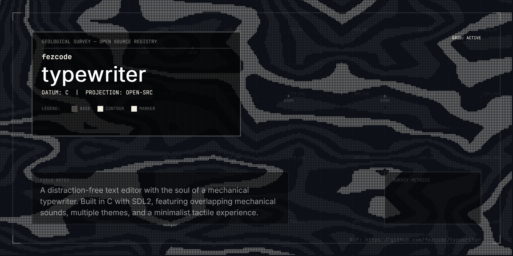
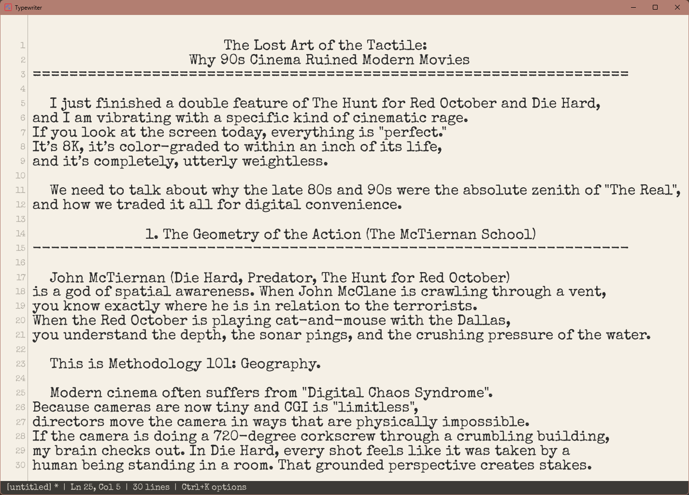

# Typewriter



A distraction-free text editor with the soul of a mechanical typewriter.

Built in C with SDL2 — fast, lightweight, cross-platform. Every keystroke clicks. Every carriage return clunks. The paper is warm, the cursor blinks, and the bell rings at column 80.

## Features

- **Real typewriter sounds** — recorded mechanical key strikes, embedded directly in the binary. Supports concurrent/overlapping playback for a true tactile feel.
- **Paper aesthetic** — Multiple themes including Classic Cream, Dark Mode, and Terminal Green.
- **Paper effects** — optional coffee rings, ink spills and creases on the page, drawn procedurally and coloured to suit the theme. Off by default; switch it on in the Options menu.
- **Struck type** — every character sits a hair off the line and carries its own amount of ink, the way a real typeface strikes a page. On by default.
- **Carriage backspace** — optional typewriter behaviour: backspace runs the carriage back without lifting the ink, and the next key strikes on top of what is already there. Off by default.
- **Lightweight** — single C file, near-zero CPU at idle.
- **Cross-platform** — Windows, macOS, Linux.
- **Self-contained** — one executable, nothing to install: sounds, icon and the typewriter font are embedded, and SDL2 is linked in statically.
- **Find & Replace** — Built-in search and replace functionality with a custom dialog (`Ctrl+F`).
- **Settings Persistence** — Automatically saves your preferences (sounds, line numbers, theme) to `typewriter.ini`.
- **File Support** — Open and save `.txt`, `.md`, and `.ini` files using native system dialogs.
- **Drag and drop** — drop a file onto the window to open it.
- **Undo** — `Ctrl+Z` with a 512-entry history.
- **Options menu** — `Ctrl+K` to toggle sounds, line numbers, notebook lines, and cycle themes.
- **Hisashi menubar** (Windows) — with [Hisashi](https://github.com/fezcode/hisashi) running, File / Edit / View / Help menus with every option and shortcut appear in its macOS-style menu bar. Off by default; switch it on in the Options menu.



## Download

Prebuilt self-contained executables are attached to each [GitHub release](https://github.com/fezcode/typewriter/releases):

| File | Platform |
|------|----------|
| `typewriter-windows-x86_64.exe` | Windows 10/11 (64-bit) — just run it |
| `typewriter-linux-x86_64.tar.gz` | Linux x86_64, glibc ≥ 2.35 (Ubuntu 22.04+, Fedora 36+, …) — `tar xzf` and run `./typewriter` |
| `typewriter-macos-universal.tar.gz` | macOS 11+ on Apple Silicon and Intel — `tar xzf` and run `./typewriter` |

The binaries are not code-signed. On macOS, Gatekeeper may refuse to open a downloaded copy; run `xattr -d com.apple.quarantine typewriter` once to clear the quarantine flag.

Settings are stored in `typewriter.ini` next to the executable, so keep it in a writable folder.

## Build

Requires SDL2 and SDL2_ttf development libraries for the default (dynamically linked) build.

**Windows (MSYS2/MinGW)**

```sh
pacman -S mingw-w64-x86_64-SDL2 mingw-w64-x86_64-SDL2_ttf
mingw32-make
```

**macOS**

```sh
brew install sdl2 sdl2_ttf
make
```

**Linux (Debian/Ubuntu)**

```sh
sudo apt install libsdl2-dev libsdl2-ttf-dev
make
```

### Self-contained build

`make STATIC=1` links SDL2, SDL2_ttf and FreeType into the executable so it runs on a machine with nothing else installed.

**Windows (MSYS2/MinGW)** — the MSYS2 packages above already include the static libraries:

```sh
mingw32-make STATIC=1
```

or, from any PowerShell prompt, `.\build.ps1` (auto-detects MSYS2; `-Clean`, `-Run`, `-Dynamic`, `-Installer`).

**Linux / macOS** — first build static SDL2 and SDL2_ttf into `deps/` (needs `cmake`, a C/C++ compiler and `curl`; on Linux also the X11/Wayland/ALSA/PulseAudio `-dev` packages listed at the top of `scripts/build-deps.sh`):

```sh
make deps        # once; downloads and builds SDL2 + SDL2_ttf statically
make STATIC=1
```

On macOS this produces a universal (arm64 + x86_64) binary. On Linux the result depends only on glibc; SDL2 loads X11/Wayland and audio backends from the system at runtime.

The same steps run in GitHub Actions (`.github/workflows/release.yml`) for every push, and pushing a `v*` tag publishes the three binaries as a release.

## Releasing

The version lives in two places — `TYPEWRITER_VERSION` in `main.c` and `[app] version` in `forge.toml` (the installer scripts read the manifest) — so a release is:

1. Bump `TYPEWRITER_VERSION` in `main.c` and `[app] version` in `forge.toml`; commit.
2. **Windows installer** — `.\build.ps1 -Installer` builds the static `typewriter.exe` and stamps `dist\Typewriter-Setup-<version>.exe` with [Forge](https://github.com/fezcode/Forge) (`forge.toml`; needs `..\Forge\build\forge.exe`). The installer is per-user (`%LOCALAPPDATA%\Programs\Typewriter`), adds Start Menu / desktop shortcuts, registers in Add/Remove Programs and keeps `typewriter.ini` on uninstall.
3. **macOS app** — on a Mac, `./package_macos.sh --dmg` builds the universal binary and assembles `dist/macos-universal/Typewriter.app` plus `dist/Typewriter-<version>.dmg` (ad-hoc signed; pass `--sign "Developer ID Application: …"` and notarize for wider distribution).
4. Tag and publish: `git tag v<version> && git push --tags`. CI attaches the raw Windows/Linux/macOS binaries to the release; add the installer and the image with `gh release upload v<version> dist/Typewriter-Setup-<version>.exe dist/Typewriter-<version>.dmg`, then write the release notes.

## Usage

```
typewriter [options] [file]

Options:
  -h, --help       Show help and exit
  -v, --version    Show version and exit
```

## Keyboard Shortcuts

| Shortcut | Action |
|----------|--------|
| **Ctrl+S** | Save |
| **Ctrl+O** | Open |
| **Ctrl+Q** | Quit |
| **Ctrl+Z** | Undo |
| **Ctrl+F** | Find & Replace |
| **Ctrl+K** | Options menu |
| **Ctrl+C / X / V** | Copy / Cut / Paste |
| **Ctrl+A** | Select all |
| **Esc** | Clear selection / Close dialog |

### Options Menu (`Ctrl+K`)
- **Up/Down**: Navigate options
- **Left/Right / Space / Enter**: Cycle themes, change the font size, or toggle options
- **Esc**: Close menu

Rows: Sound effects · Line numbers · Notebook lines · Theme · Font size · Paper effects · Strike variation · Carriage backspace · Hisashi menubar (Windows only).

### Find & Replace (`Ctrl+F`)
- **Tab**: Switch between Find and Replace fields
- **Enter**: Find next occurrence
- **Shift+Enter**: Replace current match
- **Esc**: Close dialog

### Save Dialog
- **S**: Save and quit
- **D / N**: Don't save and quit
- **C / Esc**: Cancel

## Hisashi menubar (Windows)

[Hisashi](https://github.com/fezcode/hisashi) 0.5+ provides a macOS-style global menu bar for Windows. Turn on **Hisashi menubar** in the Options menu (`Ctrl+K`) and, whenever Typewriter is the foreground window, the bar shows:

| Menu | Items |
|------|-------|
| **File** | Open…, Save, Quit |
| **Edit** | Undo, Cut, Copy, Paste, Select All, Find & Replace… |
| **View** | Sound effects ✓, Line numbers ✓, Notebook lines ✓, Paper effects ✓, Strike variation ✓, Carriage backspace ✓, Theme ▸ (Classic Cream / Dark Mode / Terminal Green), Font size, Larger font, Smaller font, Options… |
| **Help** | Keyboard Shortcuts…, version |

Checkmarks track the live settings and every row shows its keyboard shortcut. The integration is the single-header `hoswl.h` client vendored from Hisashi (`sdk/hoswl`): no threads, nothing ever blocks on the pipe, and if Hisashi is not running Typewriter simply retries every couple of seconds. The setting is persisted as `hisashi_menubar=` in `typewriter.ini`.

## Paper effects

Turn on **Paper effects** in the Options menu (`Ctrl+K`) and the page picks up a few marks: two coffee rings, four ink spills with their droplets, and three creases. They are generated pixel by pixel into a single texture that is laid over the paper *under* the text, so nothing you write ever competes with a stain for legibility.

Each theme carries its own colours for the three kinds of mark, since a brown ring would be invisible on Terminal Green. The seed is fixed, so this is the same sheet of paper every time you open the program rather than a fresh mess on each launch, and the texture is rebuilt only when the window is resized or the theme changes — never per frame. The setting is persisted as `paper_effects=` in `typewriter.ini`.

## Struck type

Body text is drawn a glyph at a time. Each cell sits up to a pixel off the
baseline, drifts a little left or right, and carries its own amount of ink, so
no two `e`s on the page are quite the same impression — and about one character
in twenty-five comes out light, the way a key does when the ribbon is tired.

The variation is derived from the line and column, not from a running random
number, so a given cell always strikes the same way: the page does not shimmer
between redraws and scrolling never reshuffles the ink.

This replaced a whole-line `TTF_Render` that built a fresh surface and texture
for every visible line on every frame. Glyphs now come from a cache of one
texture per printable ASCII character, tinted and faded at blit time, so the
effect costs nothing — a redraw allocates nothing at all, and changing theme is
free. Turn it off with **Strike variation** in the Options menu (`Ctrl+K`) and
text renders dead straight at full ink. Persisted as `strike_variation=`.

## Carriage backspace

Turn on **Carriage backspace** in the Options menu (`Ctrl+K`) and backspace
stops erasing. Instead it does what the key does on a typewriter: runs the
carriage back over the ink without lifting any of it, and stops dead at the
left margin — ringing the bell rather than reaching up to the line above.

Because a typewriter has no insert, the mode also makes typing overstrike: a
key struck over an occupied column lands on top of what is already there. The
character that was there stays visible underneath, drawn faintly and off by a
pixel, so `cat` backspaced over and typed `xxx` reads as three double
impressions rather than as clean replacement. That is how you cross a word out
on a real machine.

The ghosts are cosmetic and one strike deep. They are never written to the
file, copied to the clipboard or matched by Find — the buffer holds exactly the
characters you last struck — and any edit that rearranges a line structurally,
such as splitting it or deleting a selection, simply drops them.

The escape hatch is always there: **Delete** still erases forward, selecting
text and typing still replaces it, and `Ctrl+Z` still undoes an overstrike and
puts the original character back. The status bar shows `OVR` while the mode is
on. Persisted as `carriage_backspace=`.

## Fonts

The [Special Elite](https://fonts.google.com/specimen/Special+Elite) typewriter font (Apache 2.0) is embedded in the executable, so no font files are needed. To use a different font instead, either:

- Place `typewriter.ttf` next to the executable
- Set the `TYPEWRITER_FONT` environment variable to a `.ttf` path

Both take precedence over the embedded font. To change the embedded font itself, replace `typewriter.ttf` in the source tree and run `make embed-font` (needs `xxd`) before building.

## License

MIT

## Application icon

The editable icon design lives in `tools/make-icon.py`. Run
`python tools/make-icon.py` with Python, Pillow and a C compiler (`gcc`, or set
`CC`) to regenerate the SVG, PNG and multi-resolution Windows ICO assets.
The same generated C renderer supplies the runtime window icon, with no external image dependency.
